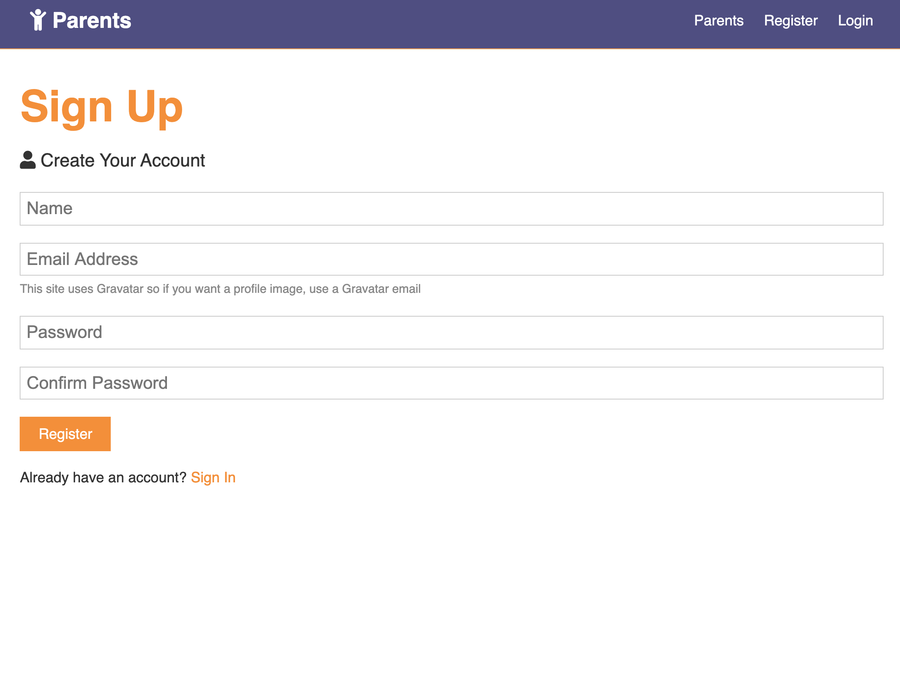
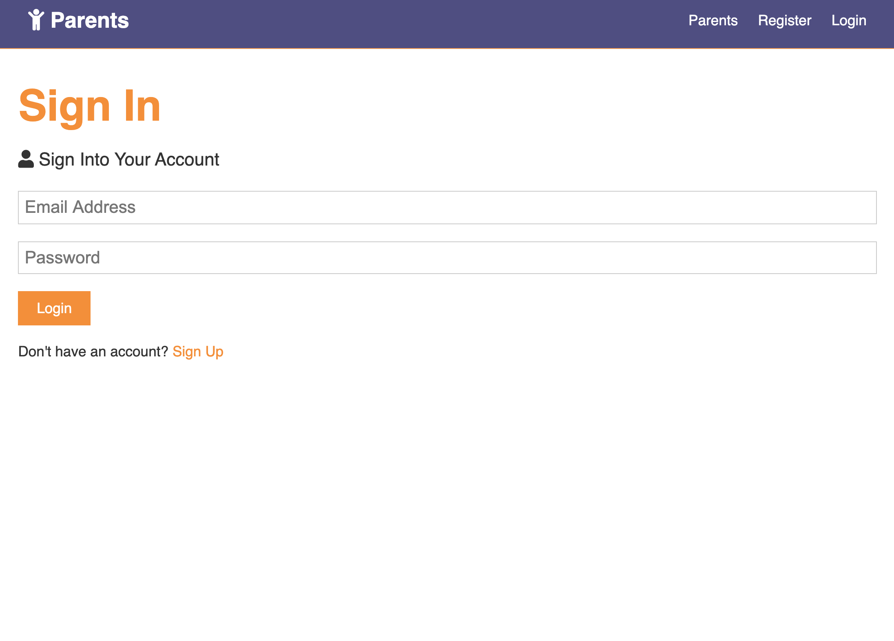
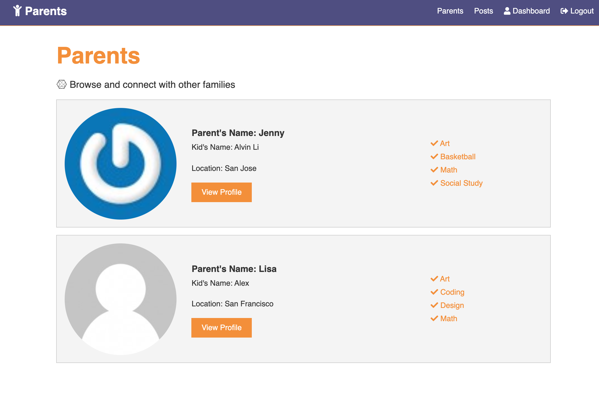
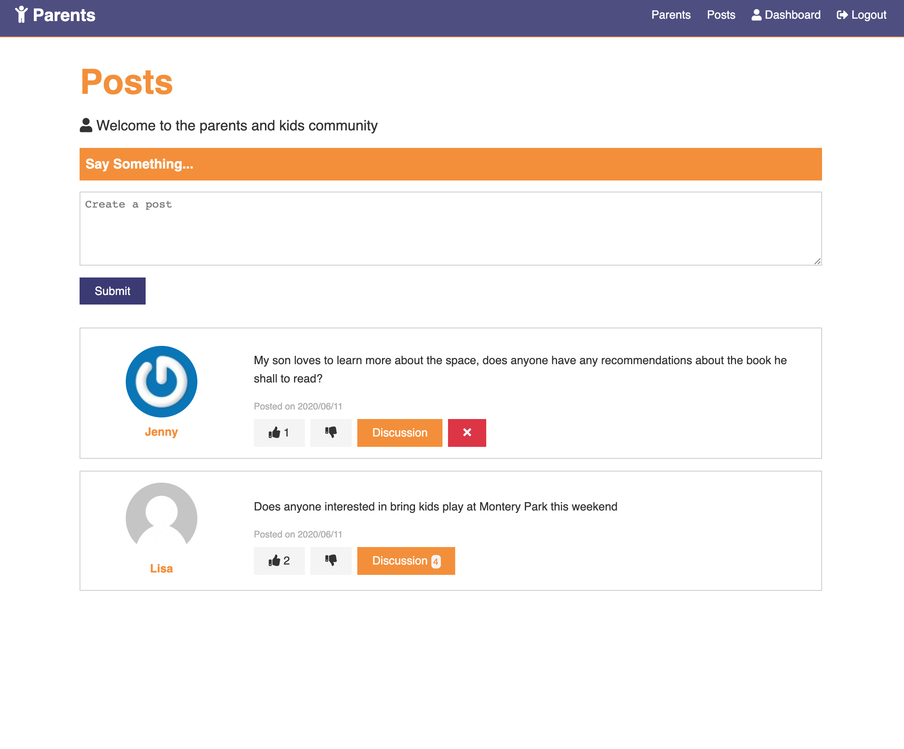

#### Welcome to Classroom Planet.

##### When schools starts to shut down, and kids start their online classes this year, parents have more jobs to do on weekdays, which are checking their kids class schedules and homeworks. This is very hard for parents, and a lot of time, they don't have efficient way to communicate with their kids teachers. 

##### It will be great if there is a tool for parets they can commicate with each other about the classes, homeworks and activities. 

##### When you go to the homepage, you will know this application is for parents and children.


##### Please click the sign up page to register an account



##### If you already have an account, please click the sign Login button



##### Sign in error alert


##### You can build your profile


##### Other parents can also visit your profile page


##### Parents can also check all the parents in this community


##### You can also create a post or comment, like, dislike other parents' post, this is a good place for parents to communicate with each other



##### The application has 3 models
- UserSchema, track all the users' information
- ProfileSchema, the information on users' profile page
- PostSchema, to track all the post, comments, like, dislike, the date of the posts/comments, the user give the comments


##### We have very security way to store user's password
- We hash user's password using bcrypt.js, to install it
``` javascript
npm i bcrypt
```
A salt will be generate and the password will be hashed in 2 steps, easy and simple way
``` javascript

            const salt = await bcrypt.genSalt(10);

            user.password = await bcrypt.hash(password, salt);
```


##### Technologies I use in this project
- Javascript
- HTML
- CSS
- React
- React Hook
- Redux
- Express.js
- Node.js
- Mongoose
- MongoDB


